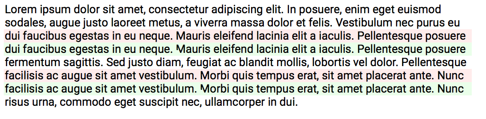

# ttfdiff

`ttfdiff` is a utility for testing fonts. Given a collection
of TrueType or OpenType fonts before and after some change,
it typesets a PDF for human inspection.

For every line in the specimen text, the tool renders two raster
images in high resolution. One image is typeset using the old font
version, another with the new version. If there is any difference
between these two high-resulution images (even if it just whitespace,
for example when kerning has changed), the output PDF will highlight
the difference in color.




## Specimen

The specimen format is HTML with embedded CSS styling:
```html
<html lang="la">
  <p>Lorem <span style="font-weight:700">ipsum</span> dolor sit amet.</p>
</html>
```

## Limitations

This is not an official Google product. We just needed some small tool
for testing our font production pipeline, and perhaps you will find it
useful, too.  However, please understand the limitations:

* *Not a full renderer:* HTML and CSS are much richer than what this
  little testing tool supports. If you miss something, please do not
  hesitate to make the change yourself and send a pull request.

* *Lousy codebase:* The current state of the codebase is pretty
  embarrassing: No tests, too many dependencies, and so on. This is
  not a real product, and definitely not a showcase for writing
  production code.

* *Not secure:* Do not run this tool on untrusted input. It parses
  complicated input formats (TrueType, OpenType, HTML) but is not
  hardened in any way.  Use it at your own risk.


## Building

```sh
$ git clone --recursive https://github.com/googlei18n/ttfdiff.git
$ cd ttfdiff
$ ./src/third_party/gyp/gyp -f make --depth . --generator-output build src/ttfdiff/ttfdiff.gyp
$ make --directory build
$ build/out/Default/ttfdiff \
    --before path/to/old/FooFont*.ttf \
    --after path/to/new/FooFont*.ttf \
    --specimen src/ttfdiff/specimen.html \
    --out out.pdf
```

This incantation seems to work on reasonably recent versions of MacOS X.
If you want to support other platforms, please feel free to make the change;
pull requests are very welcome.


## Contributing

If you are bored and want to get your hands dirty, here’s a few ideas:

* *Port to other platforms.* This will be a very easy starter task
  for people familiar with the respective platforms, and it should
  not take more than a few hours since the project already uses
  cross-platform libraries and a cross-platform build system.

* *Highlight deltas within the line.* Currently, the tool just
  highlights lines where there is any difference between the old and
  the new version of a font. However, the output PDF does not show
  where exactly this delta is located. Highlighting the delta
  locations inside each line would be quite useful for font designers,
  since it is much easier to spot the interesting place.  To implement
  this, one could probably run the classical diff algorithm to find
  additions/removals/changes, but comparing vertical 1-pixel columns
  instead of characters.  There are a couple free libraries that
  implement diffing on arbitrary objects, for example
  [DTL](https://github.com/cubicdaiya/dtl/blob/master/test/Objdifftest.cpp).
  This task probably takes a week to implement.

* *Tests.* Currently, the codebase is entirely untested which is clearly
  not ideal.

* *More constructs from CSS and HTML.* For developing high-quality fonts,
  [font-feature-settings](https://www.w3.org/TR/css-fonts-3/#font-rend-desc)
  would be particularly useful.

* *MathML.* With (even limited) support for MathML rendering,
  font designers could use ttfdiff to test their mathematical fonts.

* *Sandboxing.* To protect users against attacks that use malicious
  font or specimen files, set up a
  [sandbox](https://en.wikipedia.org/wiki/Sandbox_%28computer_security%29)
  early in the tool’s execution and then do all the rendering inside
  the sandbox.

* *CSS box model.* It might be nice to properly support the layout of
  CSS and HTML, where boxes can be inside boxes. Not sure if this is
  terribly important for testing/diffing fonts, but if this tickles
  your interest, go ahead.

* *Reduce the binary size.* To avoid dependency hell and have reproducible
  versions, ttfdiff is statically linked to all its dependencies.
  This is an intentional choice, but ICU’s data files are _huge_.
  By building a static ICU data library that contains just break iterators,
  the size of the compiled binary would get about 20MB smaller.

* *Improve paragraph layout.* The current paragraph layout is rather
  ad-hoc. We alrady use [ICU](http://site.icu-project.org/) for
  finding potential line break positions, which is rather non-trivial
  in languages like Thai, Khmer, or Lao. However, there is no
  hyphenation, and the current support for bi-directional text
  is a little iffy.

Have fun!
